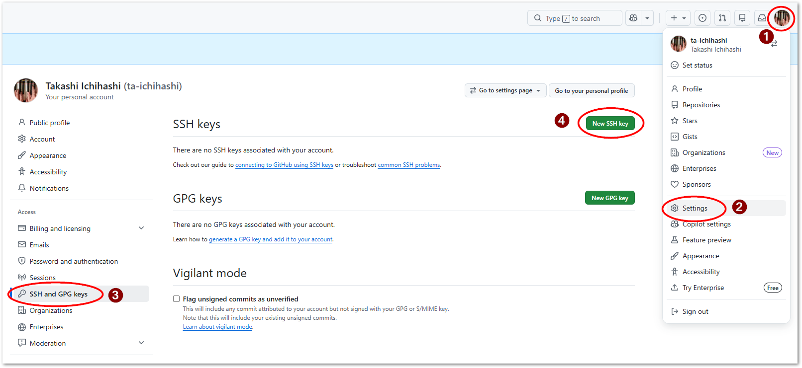
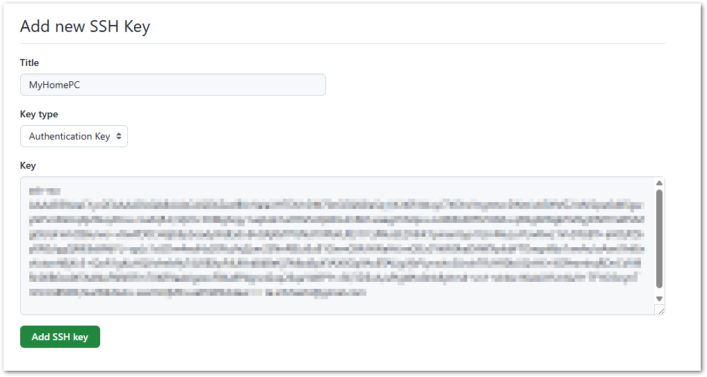

# Githubアカウント作成とリポジトリ準備

## アカウント作成

1. こちらを参考にしてGithubアカウントを作成してください。

    ```{button-link} https://docs.github.com/ja/get-started/start-your-journey/creating-an-account-on-github
    :color: primary
    :outline:

    {fab}`github` Github アカウントの作成
    ```

2. アカウントを作成したら、WEBページ管理者へ該当アカウントをメールでお伝えください。[wmoc2027組織アカウント](https://github.com/orgs/wmoc2027/people) へメンバー登録を行います。
   
## SSH公開鍵の登録

1. PC上でコマンドターミナルを起動し、次のコマンドを発行します。

    ```{code-block} powershell
    ssh-keygen -t ed25519 -C "email@example.com"
    ```
    `email@example.com` の部分はあなたのメールアドレスとしてください。

    ```{code} powershell
    Generating public/private rsa key pair.
    Enter file in which to save the key (/c/Users/????/.ssh/id_rsa):
    Enter passphrase (empty for no passphrase):
    Enter same passphrase again:
    ```

    途中でプロンプトで入力を求められますが、すべてリターンのみ入力してください。

    `%HOMEPATH%` (`C:\Users\****`) 以下に `.ssh` フォルダができています。この下にある `id_rsa.pub` ファイルが公開鍵ファイルです。これをテキストエディタで開いて内容を全てクリップボードに記憶させてください。次手順に示すGithubの設定で、アカウントにssh公開鍵を登録します。

    クリップボードへの出力は次のコマンドでも実行可能です。

    ```{code}
    clip < %HOMEPATH%\.ssh\id_rsa.pub
    ```

2. Githubのあなたのアカウントへ公開鍵を登録します。

    右上アイコンから`Settings`を選択し、左側のメニューから`SSH and GPG keys`を選択し、`New SSH Key`ボタンを押します。

    {align=center}

    Titleフィールドに接続する端末がわかる名称を記入し、Keyにクリップボードを貼り付け、最後に`Add SSH Key`ボタンを押します。
    {align=center}

## 自分のアカウントへのフォーク


次節以後の手順のとおり[https://github.com/wmoc2027/public_website](https://github.com/wmoc2027/public_website)を自分のアカウントにフォークします。
